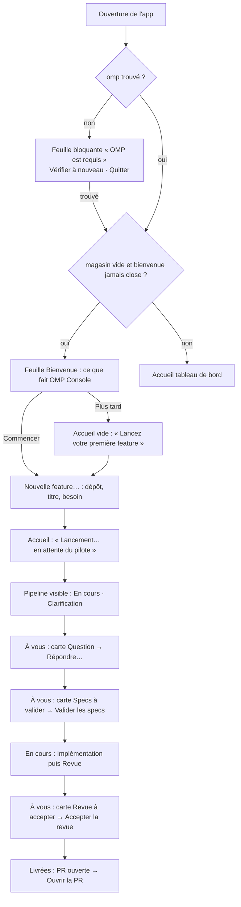

# Refonte d'OMP Console — proposition

Proposition de réorganisation des écrans et des parcours d'OMP Console, écrite
**avant toute modification du code** (feature `omp-console-redesign`, besoin B-1).

**Statut :**

- **Révision 1 — validée telle quelle par l'utilisateur le 2026-09-30** (session de
  spécification, avant toute modification des fichiers de l'app).
- **Révision 2 — validée telle quelle par l'utilisateur le 2026-10-01** (ask de la
  session de spécification, avant toute modification du code qui l'applique),
  après la recette des captures (AC-2) : l'utilisateur avait refusé huit écrans
  sur quatorze (« console de logs », « nerd », « pas du tout design ») et demandé
  une feuille d'accueil modale, une fenêtre modale quand OMP manque, des cartes
  d'attente conformes aux Apple HIG, le retrait des anomalies techniques de
  Pipelines et la reprise de Sessions, Session OMP, Statistiques et Visionneuse.
  Choix tranchés à la validation : « OMP est requis » en feuille sur la fenêtre
  principale ; bienvenue en UN écran de présentation qui ouvre ensuite la feuille
  « Nouvelle feature » ; anomalies du magasin derrière un bouton « Diagnostic
  (n) ». Les écrans validés à la recette (feuille « Nouvelle feature », section
  Projet) ne changent pas. Cette révision est commitée SEULE, avant le code qui
  l'applique.

Elle fait foi pour la refonte : ce qui n'est pas dessiné ici n'est pas livré.

Public visé : **un développeur solo qui découvre OMP**. Il a installé et configuré
OMP, il n'a jamais lancé de pipeline, il ne connaît ni `/req`, ni les lots, ni le
panneau `/pipelines`. Il veut : choisir un dépôt, décrire ce qu'il veut, puis
suivre et répondre — sans terminal, sans doc, sans ouvrir OMP à la main.

## 1. Principes

1. **L'app s'ouvre sur ce qui vous attend.** Nouvel écran d'accueil par défaut :
   les questions et jalons en attente d'abord, puis les pipelines en cours, puis
   les PR livrées. Le tableau complet reste à un clic.
2. **Un seul geste pour commencer.** « Nouvelle feature… » est partout (barre
   d'outils, menu, accueil vide) et ouvre une seule feuille : dépôt, titre,
   besoin, Lancer.
3. **L'app conduit elle-même.** Aucune session OMP n'est à ouvrir : quand un
   geste vise un dépôt qu'aucun pilote ne conduit, l'app démarre en arrière-plan
   un `omp` sans interface (le *conducteur*) qui prend la commande en charge.
4. **Rien ne disparaît.** Les dix fonctions actuelles restent atteignables ; deux
   changent de nom, aucune n'est retirée (§ 5).
5. **Liquid Glass natif, macOS 26 minimum.** Navigation et commandes flottent dans
   la couche de verre (barre latérale, barre d'outils, boutons) ; le contenu reste
   opaque et lisible. Pas de fonds colorés maison sous la navigation.
6. **Un produit Apple, pas un outil de développeur** *(révision 2)*. Chaque écran
   parle la langue de l'utilisateur : étapes nommées (« Clarification »,
   « Implémentation »…), états en capsules de couleur doublées d'un mot, dates
   relatives, nombres arrondis (« 12,4 k »), symboles SF. Les composants sont ceux
   du système (`ContentUnavailableView`, `Form` groupé, inspecteur, `Table`,
   graphiques Swift Charts, feuilles). Les **détails techniques** (pid, chemins
   du magasin, trames JSON, identifiants de session, compteurs d'entrées
   ignorées) ne sont jamais au premier plan : ils restent consultables derrière un
   pli ou un bouton « Détails techniques ». Aucun texte d'interface en police
   monospacée, sauf le contenu technique lui-même (terminal, diff, arguments
   d'outil, chemins cherchés).

## 2. Carte de l'app

```
Fenêtre principale « OMP Console »
├─ barre d'outils : [+ Nouvelle feature…] [Terminal] [Session OMP] [Statistiques]
├─ barre latérale (verre)
│   Pilotage
│   ├─ Accueil ........... NOUVEAU — attentes (cartes), en cours, livrées ; 1re fois
│   ├─ Pipelines ......... ex-« Kanban » (11 colonnes + inspecteur + gestes)
│   └─ Projet ............ conduite de projet + suivi PR/CI (inchangé)
│   Consultation
│   ├─ Sessions .......... liste des runs par jour → visionneuse
│   ├─ Fichiers .......... arbre, document, diff (inchangé)
│   └─ Mémoire ........... mem0 en lecture seule (inchangé)
│   ─────────────
│   [capsule d'état : occupés · en attente | notifications désactivées]
├─ feuille « Bienvenue » ........ NOUVEAU (rév. 2) — 1er lancement, un écran
├─ feuille « OMP est requis » ... NOUVEAU (rév. 2) — bloquante tant qu'OMP manque
├─ feuille « Nouvelle feature » . NOUVEAU
└─ feuille « Répondre » ......... NOUVEAU (rév. 2) — question d'une attente

Fenêtres séparées
├─ Terminal (⌘T)            ├─ Session OMP (⌘N) — conversation (rév. 2)
├─ Projet (⌘⇧N)             ├─ Statistiques (⌘⇧S) — tableau de bord (rév. 2)
└─ Visionneuse de session (une par run, ouverte depuis Sessions) — conversation (rév. 2)

Menu Aide ▸ « Bienvenue dans OMP Console » rouvre la feuille de bienvenue.
Barre de menus macOS : icône + compteurs « occupés·en attente », clic = fenêtre.
Conducteurs (invisibles) : un `omp --mode rpc` par dépôt conduit par l'app.
```

Une seule feuille à la fois sur la fenêtre principale, dans cet ordre de
priorité : « OMP est requis », puis « Bienvenue », puis « Nouvelle feature » ou
« Répondre » (celle que l'utilisateur a demandée).

## 3. Parcours de première fois

Hypothèse : OMP installé et configuré, magasin d'état vide (aucun lot, aucun run,
aucun historique, aucun projet).



Étape par étape, ce que voit l'utilisateur :

1. **Feuille « Bienvenue »** (premier lancement seulement) — trois promesses de
   l'app. « Commencer » ferme la bienvenue et ouvre la feuille « Nouvelle
   feature ». « Plus tard » la ferme seulement. Dans les deux cas elle ne revient
   pas seule aux lancements suivants (menu Aide pour la revoir).
2. **Feuille « Nouvelle feature »** — il choisit un dossier (le sélecteur
   n'accepte qu'une racine de dépôt git), donne un titre court (il devient la
   branche `feat/<titre>`) et décrit son besoin en quelques phrases. « Lancer ».
3. **Accueil, bandeau de lancement** — « Lancement de « export-csv »… en attente
   du pilote », puis « pipeline lancée » dès l'accusé. Si aucun pilote ne répond
   en 20 s, le bandeau le dit et nomme la cause probable (§ 7).
4. **En cours** — la pipeline apparaît avec son étape (« Clarification ») et sa
   durée.
5. **À vous** — chaque question de l'agent arrive en carte en tête de l'accueil ;
   « Répondre… » ouvre une feuille avec la question, ses options et un champ
   libre. Les jalons ont leur bouton sur la carte : « Valider les specs »,
   « Accepter la revue ».
6. **Livrées** — la PR ouverte apparaît avec « Ouvrir la PR ».

## 4. Écrans (wireframes)

Légende : `▒` = verre (Liquid Glass), `[Bouton]` = bouton en verre,
`[[Bouton]]` = bouton en verre proéminent (action principale), `(●Libellé)` =
capsule d'état colorée, `⌄` = pli fermé.

### 4.1 Feuille « Bienvenue » et Accueil vide *(révision 2)*

Présentée au premier lancement, au-dessus de l'Accueil :

```
            ┌──────────────────────────────────────────────────────┐
            │                                                      │
            │                       ◉  (symbole de l'app)          │
            │             Bienvenue dans OMP Console               │
            │                                                      │
            │   💬  Décrivez un besoin                              │
            │       OMP le clarifie avec vous, puis le spécifie.   │
            │   ✅  Répondez et validez                             │
            │       Les questions et les jalons arrivent ici.      │
            │   ⤴  Recevez la pull request                         │
            │       OMP implémente, relit et ouvre la PR.          │
            │                                                      │
            │                             [Plus tard] [[Commencer]]│
            └──────────────────────────────────────────────────────┘
```

Accueil vide (bienvenue close sans lancement, magasin toujours vide) — vue
système « contenu indisponible », centrée :

```
┌──────────────┬─────────────────────────────────────────────────────────────┐
│▒ Pilotage    │                                                             │
│▒ ◉ Accueil   │                         ✦ (symbole)                          │
│▒   Pipelines │               Lancez votre première feature                 │
│▒   Projet    │      Décrivez un besoin : OMP le clarifie avec vous, le      │
│▒ Consultation│      spécifie, l'implémente et ouvre la PR.                  │
│▒   …         │                  [[+ Nouvelle feature…]]                     │
└──────────────┴─────────────────────────────────────────────────────────────┘
```

### 4.2 Accueil — tableau de bord *(révision 2)*

```
┌──────────────┬─────────────────────────────────────────────────────────────┐
│▒ Pilotage    │  À vous                                Voir toutes les pipelines │
│▒ ◉ Accueil ③ │  ▒(?) QUESTION · il y a 4 min ▒ ▒(📄) SPECS À VALIDER ·12 min▒│
│▒   Pipelines │  ▒ export-csv                 ▒ ▒ dark-mode                   ▒│
│▒   Projet    │  ▒ mem0-omp                   ▒ ▒ mem0-omp                    ▒│
│▒ Consultation│  ▒ Quel séparateur pour le    ▒ ▒ Validez les specs pour      ▒│
│▒   Sessions  │  ▒ CSV ?                      ▒ ▒ lancer l'implémentation.    ▒│
│▒   Fichiers  │  ▒              [[Répondre…]] ▒ ▒        [[Valider les specs]]▒│
│▒   Mémoire   │                                                             │
│▒             │  En cours                                                   │
│▒             │  ┌──────────────────────────────────────────────────────┐   │
│▒             │  │ 🔨 api-rate        mem0-omp · Implémentation    14 min │   │
│▒             │  │ ✓ batch-api   autre-depot · Revue (●En pause) [[Reprendre]]│
│▒             │  └──────────────────────────────────────────────────────┘   │
│▒             │  Livrées récemment                                          │
│▒             │  ┌──────────────────────────────────────────────────────┐   │
│▒ ▒occupés 2 ·│  │ ⤴ login-fix   mem0-omp · (●PR ouverte)  [Ouvrir la PR] │   │
│▒ attente 3▒  │  └──────────────────────────────────────────────────────┘   │
└──────────────┴─────────────────────────────────────────────────────────────┘
```

- **Cartes « À vous »** : grille adaptative (une à trois colonnes selon la
  largeur), cartes de même hauteur en verre. Chaque carte : symbole de la nature
  dans un disque teinté, nature en petites capitales et ancienneté relative,
  titre de la feature, dépôt, question ou consigne sur trois lignes au plus, un
  seul bouton principal en bas à droite. Une question → « Répondre… » ouvre la
  **feuille « Répondre »** (§ 4.2 bis). Un jalon → le bouton agit directement.
- **En cours** et **Livrées récemment** : listes groupées du système (fond
  arrondi, séparateurs), une ligne = symbole d'étape, titre, « dépôt · étape »,
  durée ou capsule d'état, geste éventuel. Un pilote arrêté se lit « (●En
  pause) » + « Reprendre ».
- Le journal des gestes quitte l'Accueil (le bandeau de lancement suffit) ; il
  reste dans Pipelines (§ 4.5).
- Le badge ③ sur « Accueil » compte les attentes.

### 4.2 bis Feuille « Répondre » *(révision 2)*

```
            ┌──────────────────────────────────────────────────────┐
            │  export-csv                                          │
            │  mem0-omp · Clarification                            │
            │  ┌────────────────────────────────────────────────┐  │
            │  │ Quel séparateur pour le CSV ?                  │  │
            │  └────────────────────────────────────────────────┘  │
            │   ◉ virgule            standard RFC 4180             │
            │   ○ point-virgule      Excel en français             │
            │   [ ou écrivez votre réponse…                    ]   │
            │                               [Annuler] [[Répondre]] │
            └──────────────────────────────────────────────────────┘
```

Question en texte d'un maillon terminé : même feuille, sans options. Envoyer
ferme la feuille ; la carte quitte « À vous » dès que la pipeline repart.

### 4.3 Feuille « OMP est requis » *(révision 2)*

Feuille modale sur la fenêtre principale, impossible à fermer tant qu'OMP est
introuvable (ni Échap, ni clic dehors) :

```
            ┌──────────────────────────────────────────────────────┐
            │                        ⚠ (jaune)                     │
            │                   OMP est requis                     │
            │   OMP Console pilote vos pipelines à travers OMP,    │
            │   introuvable sur ce Mac. Installez OMP, puis        │
            │   vérifiez à nouveau.                                │
            │   ⌄ Emplacements cherchés                            │
            │   OMP est toujours introuvable. (après un nouvel échec)│
            │                     [Quitter] [[Vérifier à nouveau]] │
            └──────────────────────────────────────────────────────┘
```

Déplier « Emplacements cherchés » montre la liste des chemins (police
monospacée) et le chemin imposé par `OMP_CONSOLE_OMP_BINARY` s'il y en a un. Dès
qu'OMP est trouvé, la feuille se ferme et le parcours reprend (bienvenue si le
magasin est vide). Derrière la feuille, l'Accueil montre « OMP est requis » en vue
« contenu indisponible ». Les fenêtres séparées déjà ouvertes restent utilisables.

### 4.4 Feuille « Nouvelle feature »

Validée telle quelle à la recette (C4). Inchangée.

```
┌───────────────────────────── Nouvelle feature ─────────────────────────────┐
│ Dépôt    [ mem0-omp — ~/dev/mem0-omp            ▾ ] [Choisir un dossier…]  │
│          ⚠ Ce dossier n'est pas un dépôt git (aucun .git)… (si refusé)     │
│ Titre    [ export-csv                                         ]            │
│          Devient la branche feat/<titre>.                                  │
│ Besoin   ┌───────────────────────────────────────────────────────┐        │
│          │ Décrivez ce que vous voulez obtenir…                  │        │
│          └───────────────────────────────────────────────────────┘        │
│                                            [Annuler]  [[Lancer]]           │
└────────────────────────────────────────────────────────────────────────────┘
```

### 4.5 Pipelines (ex-Kanban) *(révision 2)*

```
┌──────────────┬───────────────────────────────────────────────┬─────────────┐
│▒ …           │ En attente ⓪  En cours ①   Question ②  PR ①  │ api-rate    │
│▒ ◉ Pipelines │               ▒api-rate  ▒ ▒export-csv▒      │ mem0-omp    │
│▒             │               ▒mem0-omp  ▒ ▒mem0-omp  ▒      │ (●En cours) │
│▒             │               ▒(●En cours)▒▒(●Question)▒     │ Avancement  │
│▒             │               ▒    14 min▒ ▒     6 min▒      │ ✓Besoins ✓Specs│
│▒             │                                              │ ●Implémentation│
│▒             │                                              │ ○Revue ○PR  │
│▒             │                                              │ Action …    │
│▒             │                                              │ Informations│
│▒             │                                              │ ⌄ Détails   │
│▒             │ ⌄ Activité récente                 [Diagnostic ①]│ techniques│
└──────────────┴───────────────────────────────────────────────┴─────────────┘
```

- **Plus de bandeau d'anomalies.** Un pilote mort se lit sur la carte « (●En
  pause) » et dans l'inspecteur (« Reprendre »). Les anomalies du magasin
  (pilote mort, entrée illisible, doublon) restent consultables : bouton discret
  « Diagnostic (n) » en bas du tableau, présent seulement s'il y en a, qui ouvre
  une bulle listant leurs textes exacts.
- **Cartes** : titre, dépôt, capsule d'état colorée (le mot de l'état, jamais la
  couleur seule) et durée. Le modèle et l'URL de PR quittent la carte.
- **En-têtes de colonne** : titre et compteur en pastille.
- **Inspecteur** (panneau de droite du système, masquable par la barre
  d'outils) en formulaire groupé : en-tête (titre, dépôt, état) ; « Avancement »
  (Besoins → Specs → Implémentation → Revue → PR, étape courante marquée) ;
  « Action » (les gestes : répondre, valider, accepter, reprendre, arrêter) ;
  « Informations » (étape, durée, modèle, PR en lien) ; « Détails techniques »
  replié (marques, sources du magasin).
- **Activité récente** : le journal des gestes, replié par défaut, une ligne par
  geste avec symbole d'état et heure.

### 4.6 Projet, Fichiers, Mémoire

Contenu et comportement inchangés (Projet validé à la recette, C6). Apparence :
barre latérale et barre d'outils en verre (fenêtre principale), boutons d'en-tête
en verre, bandeaux d'avertissement en verre teinté.

### 4.6 bis Sessions *(révision 2)*

```
┌──────────────┬─────────────────────────────────────────────────────────────┐
│▒ …           │  Sessions                                                   │
│▒ ◉ Sessions  │  Aujourd'hui                                                │
│▒             │  ┌──────────────────────────────────────────────────────┐   │
│▒             │  │ [🔨] api-rate                          14:32  (●En cours) ›│
│▒             │  │      mem0-omp · Implémentation                         │   │
│▒             │  │ [💬] export-csv                        11:05  (●Terminé)  ›│
│▒             │  │      mem0-omp · Clarification                          │   │
│▒             │  └──────────────────────────────────────────────────────┘   │
│▒             │  Hier                                                       │
│▒             │  └ …                                                        │
└──────────────┴─────────────────────────────────────────────────────────────┘
```

Une liste groupée par jour (« Aujourd'hui », « Hier », puis la date), du plus
récent au plus ancien. Chaque ligne : symbole de l'étape dans un carré arrondi
teinté, titre de la feature, « dépôt · étape », heure de début, capsule d'état
(« En cours », « En attente », « Terminé », « Échec », « Interrompu » pour un run
dont le pilote a disparu), chevron. Un clic ouvre la visionneuse. Vide : vue
« contenu indisponible » (« Aucune session »).

### 4.7 Fenêtres séparées

| Fenêtre | Changement |
|---|---|
| Terminal | « Choisir… » et « Relancer » passent dans la barre d'outils (verre) ; cible et état restent dans le bandeau |
| Session OMP | **conversation** (§ 4.8) ; commandes dans la barre d'outils ; trames brutes et journal dans l'inspecteur « Détails techniques » |
| Projet | boutons d'en-tête en verre (même vue que la section Projet) |
| Statistiques | **tableau de bord** (§ 4.9) ; le sélecteur « Projet » dans la barre d'outils |
| Visionneuse | **conversation** (§ 4.8) ; « Revenir au direct » dans la barre d'outils (inactif tant que le suivi est actif) |

### 4.8 Conversation : Visionneuse et Session OMP *(révision 2)*

Un seul rendu de conversation, partagé par la visionneuse d'un run et la fenêtre
« Session OMP » (qui affiche le fichier de session de son `omp` hébergé) :

```
┌────────────────────────────────────────────────── api-rate — 01a06c2d ─────┐
│ ●●●  api-rate                           (●En direct) [[Revenir au direct]]  │
│      mem0-omp · Implémentation                                              │
├─────────────────────────────────────────────────────────────────────────────┤
│                              ┌───────────────────────────────────────────┐  │
│                              │ Ajoute une limite de débit à l'API.       │  │
│                              └───────────────────────────────────────────┘  │
│  ⌄ Réflexion                                                                │
│  Je commence par lire le routeur, puis j'ajoute un **middleware** dans      │
│  `src/api.ts`.                                                               │
│  › 📄 Lecture · src/api.ts                                     ✓            │
│  › ✏️ Modification · src/api.ts                                ✓            │
│  ──────────────────── Contexte compacté ────────────────────                │
│  ▒ Question · « Quel plafond par minute ? »  ◦ 60  ◦ 120 ▒                   │
└─────────────────────────────────────────────────────────────────────────────┘
```

- Message de l'utilisateur : bulle alignée à droite, teintée de l'accent.
- Message de l'agent : texte pleine largeur, police système, Markdown en ligne
  (gras, italique, `code`, liens) rendu.
- Réflexion : pli « Réflexion » fermé.
- Appel d'outil : une ligne compacte (symbole, verbe lisible, cible, coche ou
  croix) ; la déplier montre arguments, résultat et diff dans un bloc opaque en
  police monospacée.
- Question `ask` : carte teintée avec ses options (lecture seule ici).
- Marqueurs (compaction, résumé de branche) : séparateur centré.
- En-tête de fenêtre : titre = feature, sous-titre = « dépôt · étape » ; capsule
  « En direct » / « Suivi suspendu » / « En attente » / « Erreur de lecture ».
  Les comptes (faits, entrées ignorées) quittent l'écran : une entrée ignorée
  n'apparaît qu'en note discrète sous le fil.

**Session OMP** en plus :

```
┌────────────────────────────────── Session OMP ─────────────────────────────┐
│ ●●●  Session OMP           [📁 Choisir un dossier…] [▶ Lancer] [⋯] [ⓘ]      │
│      mem0-omp · Active                                                      │
├─────────────────────────────────────────────────────────────────────────────┤
│                  (conversation, même rendu que la visionneuse)              │
├─────────────────────────────────────────────────────────────────────────────┤
│  [ Écrivez à OMP…                                                  ] (↑)    │
└─────────────────────────────────────────────────────────────────────────────┘
```

- Sans projet : vue « contenu indisponible » « Aucune session » + « Choisir un
  dossier… ». Projet choisi, session non lancée : « Prête à démarrer » +
  « Lancer la session ». Démarrage : indicateur « Démarrage de la session… ».
- Sous-titre de fenêtre : nom du projet et état en mots (« Prête »,
  « Démarrage… », « Active », « Arrêt… », « Arrêtée », « Interrompue »,
  « Échec »).
- Un dialogue d'OMP (choix, confirmation, saisie) s'ouvre en **feuille** sur la
  fenêtre (« OMP vous demande »), avec « Annuler » (⌘.) et la réponse.
- Le mode (« dialogues actifs » / « sans dialogues ») passe dans le menu ⋯ de la
  barre d'outils, avec « Relancer » et « Arrêter la session ».
- Le bouton ⓘ « Détails techniques » ouvre l'inspecteur : trames brutes et
  journal, tels qu'aujourd'hui.

### 4.9 Statistiques *(révision 2)*

```
┌──────────────────────────────── Statistiques ── [ mem0-omp ▾ ] ────────────┐
│  ▒ Tokens envoyés ▒ ▒ Tokens reçus ▒ ▒ Temps passé ▒ ▒ Tours ▒              │
│  ▒     184 k      ▒ ▒     22,5 k   ▒ ▒   26 h 41 min ▒ ▒  37  ▒              │
│                                                                             │
│  Tokens par feature                                                         │
│  api-rate     ███████████████▒▒▒                                            │
│  export-csv   ██████▒                                                       │
│               ■ envoyés  ■ reçus                                            │
│                                                                             │
│  Runs                                                                       │
│  Feature     Étape           Modèle      Durée     Tours   Tokens   État    │
│  api-rate    Implémentation  opus        14 min    3       12,4 k   ●En cours│
│  export-csv  Clarification   sonnet      2 min     1       1,1 k    Terminé │
│  1 feature du plan sans session lisible.                                    │
└─────────────────────────────────────────────────────────────────────────────┘
```

Quatre tuiles de chiffres clés, un graphique en barres horizontales empilées
(Swift Charts), un tableau système des runs triable par colonne. États vides,
chargement et magasin absent : vue « contenu indisponible ».

## 5. Où vit chaque fonction existante

| Fonction (B-4) | Avant | Après |
|---|---|---|
| Kanban des pipelines | section « Kanban » | section « **Pipelines** » (renommée) + résumé sur l'Accueil |
| Visionneuse de session | section « Sessions » → fenêtre par run | inchangé (liste par jour, conversation) |
| Visionneuse de fichiers et diffs | section « Fichiers » | inchangé |
| Conduite de projet | section « Projet » + fenêtre « Projet » (⌘⇧N) | inchangé |
| Alertes | bande au-dessus de la fenêtre + notifications macOS | capsule en bas de la barre latérale (mêmes textes) + notifications macOS + attentes sur l'Accueil ; anomalies du magasin dans « Diagnostic » de Pipelines |
| Barre de menus | icône + compteurs | inchangé |
| Terminal intégré | fenêtre (⌘T) | inchangé + bouton de barre d'outils |
| Statistiques | fenêtre (⌘⇧S) | inchangé + bouton de barre d'outils ; tableau de bord |
| Mémoire mem0 | section « Mémoire » | inchangé |
| Suivi PR/CI | volet PR de la section/fenêtre Projet | inchangé + « Livrées récemment » sur l'Accueil |

Aucune fonction n'est supprimée. Le formulaire « Lancer une feature… » du Kanban
est remplacé par la feuille « Nouvelle feature », qui fait la même chose et plus.
Les trames brutes de Session OMP restent visibles dans son inspecteur.

## 6. Ajouts

1. **Accueil** (section par défaut) : tableau de bord (À vous en cartes, En
   cours, Livrées récemment), Accueil vide, OMP requis.
2. **Feuille « Nouvelle feature »** : choix d'un dossier quelconque (plus
   seulement les dépôts déjà connus du magasin), validation « racine git ».
3. **Conducteurs** : un `omp --mode rpc` par dépôt, démarré par l'app quand un
   geste vise un dépôt sans pilote vivant ; arrêtés à la fermeture de l'app.
4. **Reprendre** : relance un conducteur pour une pipeline dont le pilote est mort.
5. **Répondre à une question en texte** d'un maillon terminé (nouvelle commande
   `reply` du canal, côté app ET côté extension `omp-mem0-req`).
6. **Confirmation à la fermeture** quand l'app conduit des maillons en cours.
7. **Barre d'outils** de la fenêtre principale et des fenêtres séparées.
8. **Menu Fichier ▸ « Nouvelle feature… »** (⌘L).
9. **Feuille « Bienvenue »** au premier lancement (un écran de présentation qui
   ouvre la feuille « Nouvelle feature »), et menu Aide ▸ « Bienvenue dans OMP
   Console » *(révision 2)*.
10. **Feuille bloquante « OMP est requis »** *(révision 2)*.
11. **Feuille « Répondre »** depuis une carte d'attente *(révision 2)*.
12. **Inspecteur de Pipelines** et bouton « Diagnostic » *(révision 2)*.
13. **Rendu conversationnel** partagé par la visionneuse et Session OMP ;
    inspecteur « Détails techniques » de Session OMP *(révision 2)*.
14. **Tableau de bord des Statistiques** : tuiles, graphique, tableau des runs
    *(révision 2)*.

## 7. Limites assumées

- Le canal de commande exige un `omp-mem0-req` qui le porte (≥ 0.21.0 pour
  lancer/valider/arrêter ; la version publiée avec cette refonte pour `reply`).
  Un plugin plus ancien ne répond jamais : l'app l'annonce après 20 s au lieu
  d'attendre en silence.
- Fermer l'app interrompt les maillons qu'elle conduit (après confirmation) ;
  « Reprendre » les relance à la réouverture.
- Le dépôt choisi doit avoir un remote GitHub pour aller jusqu'à la PR : sinon la
  pipeline échoue à sa publication, et l'échec s'affiche sur sa carte.
- Pas de refonte des contenus terminal, diff et mémoire : seule leur enveloppe
  change. La conversation (visionneuse, Session OMP) et les statistiques, elles,
  sont refaites *(révision 2)*.
- La feuille « OMP est requis » s'ouvre au lancement, contre la recommandation
  des HIG (« Avoid showing an alert when your app starts ») : choix explicite de
  l'utilisateur, OMP étant indispensable à toute action de l'app.
